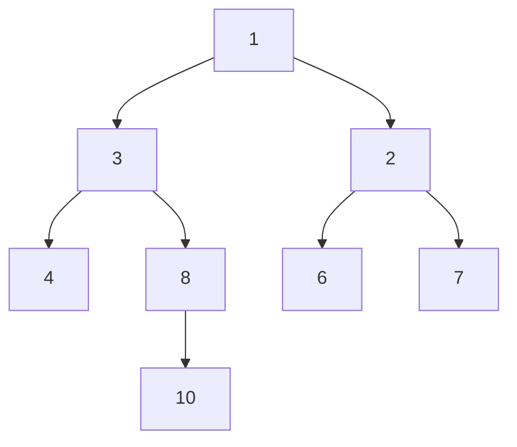

## Question

Given a binary tree return the sum of all the nodes depths

#### input:



#### Output:

sum = 13

## Solution

#### Javascript

```javascript
// This is the class of the input binary tree.
class BinaryTree {
  constructor(value) {
    this.value = value;
    this.left = null;
    this.right = null;
  }
}

function nodeDepths(root) {
  return calculateDepthSum(root, 0);
}
function calculateDepthSum(node, sum = 0) {
  if (node === null) {
    return 0;
  }
  return (
    sum +
    calculateDepthSum(node.left, sum + 1) +
    calculateDepthSum(node.right, sum + 1)
  );
}
```

#### Java

```java
import java.util.*;

class Program {

  public static int nodeDepths(BinaryTree root) {
    return calculateDepthSum( root, 0);
  }
	public static int calculateDepthSum(BinaryTree node, int sum){
		if (node == null){return 0;}
		return sum + calculateDepthSum(node.left, sum+1) +calculateDepthSum(node.right, sum+1);
	}

  static class BinaryTree {
    int value;
    BinaryTree left;
    BinaryTree right;

    public BinaryTree(int value) {
      this.value = value;
      left = null;
      right = null;
    }
  }
}

```

## Concepts

- [[data-structures.binary-trees.traverse]]
- [[data-structures.recursion]]

## Patterns

- DFS
