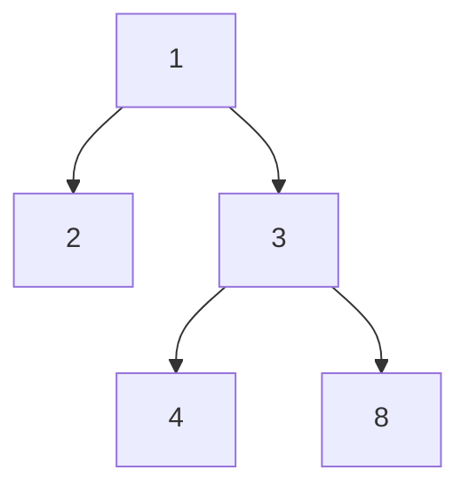

## Question

Given a binary tree, determine if it is height-balanced.

For this problem, a height-balanced binary tree is defined as:

a binary tree in which the left and right subtrees of every node differ in height by no more than 1.

https://leetcode.com/problems/balanced-binary-tree/

#### input:



#### Output:

true

## Solution

#### Javascript

```javascript
function heightBalancedBinaryTree(tree) {
  // Write your code here.
  let dfs = function (node) {
    if (!node) return 0;
    let left = 1 + dfs(node.left);
    let right = 1 + dfs(node.right);
    if (Math.abs(left - right) > 1) return Infinity;
    return Math.max(left, right);
  };

  return dfs(tree) == Infinity ? false : true;
}
//94ms
```

```javascript
function heightBalancedBinaryTree(tree) {
  // Write your code here.
  return helper(tree) != -1;
}
function helper(node) {
  if (!node) return 0;
  let left = helper(node.left);
  if (left == -1) return -1;
  let right = helper(node.right);
  if (right == -1) return -1;
  if (Math.abs(left - right) > 1) return -1;
  return Math.max(left, right) + 1;
}
//144ms
```

```javascript
class TreeInfo {
  constructor(isBalanced, height) {
    this.isBalanced = isBalanced;
    this.height = height;
  }
}

function heightBalancedBinaryTree(tree) {
  const treeInfo = helper(tree);
  return treeInfo.isBalanced;
}
function helper(node) {
  if (!node) return new TreeInfo(true, -1);

  let left = helper(node.left);
  let right = helper(node.right);

  const isBalanced =
    left.isBalanced &&
    right.isBalanced &&
    Math.abs(left.height - right.height) <= 1;
  const height = Math.max(left.height, right.height) + 1;
  return new TreeInfo(isBalanced, height);
}
// 199 ms
```

#### Java

```java

```

## Concepts

- [[data-structures.binary-trees.traverse]]
- [[data-structures.recursion]]

## Patterns

- DFS
