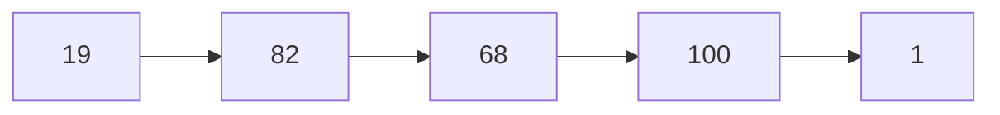

## Question

Write an algorithm to determine if a number n is happy.

A happy number is a number defined by the following process:

Starting with any positive integer, replace the number by the sum of the squares of its digits.
Repeat the process until the number equals 1 (where it will stay), or it loops endlessly in a cycle which does not include 1.
Those numbers for which this process ends in 1 are happy.
Return true if n is a happy number, and false if not.

#### input:

Input: n = 19

#### Output:



Output: true

## Solution

For this given problem, we know that for a given number it will be stuck on 1 or a different set of number. So what we can do is go through a loop until we find a cycle. Once we have reached a cycle we can break and check if the number is equal to 1 and return boolean result.

#### Javascript

```javascript
var isHappy = function (num) {
  let p1 = num,
    p2 = num;
  while (true) {
    p1 = find_square_sum(p1);
    p2 = find_square_sum(find_square_sum(p2));
    if (p1 === p2) {
      break;
    }
  }
  return p1 === 1;
};

function find_square_sum(num) {
  let sum = 0;
  while (num > 0) {
    digit = num % 10;
    sum += digit * digit;
    num = Math.floor(num / 10);
  }
  return sum;
}
// or
var isHappy = function (num) {
  let p1 = num;
  const mem = new Set();
  while (true) {
    p1 = find_square_sum(p1);
    if (mem.has(p1)) break;
    mem.add(p1);
  }
  return p1 === 1;
};

function find_square_sum(num) {
  let sum = 0;
  while (num > 0) {
    digit = num % 10;
    sum += digit * digit;
    num = Math.floor(num / 10);
  }
  return sum;
}
```

#### Java

```java

```

## Concepts

- [[Problems.linked-lists.cycle]]

## Patterns

- Two Pointer;
- Map/Set
