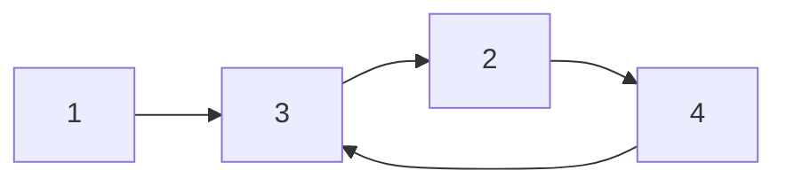

## Question

Given head, the head of a linked list, determine if the linked list has a cycle in it.

There is a cycle in a linked list if there is some node in the list that can be reached again by continuously following the next pointer. Internally, pos is used to denote the index of the node that tail's next pointer is connected to. Note that pos is not passed as a parameter.

Return true if there is a cycle in the linked list. Otherwise, return false.

#### input:



#### Output:

Output: true

## Solution

If we want to find a cycle within a linked list we can use the fast and slow pointer pattern to find our solution. We will have our slow pointer iterate through the linked list step by step, and we will have our fast pointer move 2 steps each time.

We will know if we have a cycle in our list if both our pointers have equal value, if so we can simply return false.

Another way we can solve this is using a set to keep track of our nodes in the list as we traverse through our linked list. If we find we have the same node as in our set, we can simply return true as we are in a cycle.

#### Javascript

```javascript
var hasCycle = function (head) {
  let p1 = head,
    p2 = head;
  while (p2 !== null && p2.next !== null) {
    p2 = p2.next.next;
    p1 = p1.next;
    if (p1 === p2) {
      return true;
    }
  }
  return false;
};
//or
var hasCycle = function (head) {
  const mem = new Set();
  return help(head, mem);
};
const help = (node, mem) => {
  if (mem.has(node)) return true;
  if (!node) return false;
  mem.add(node);
  return help(node.next, mem);
};
```

#### Java

```java

```

## Concepts

- [[data-structures.linked-list]]

## Patterns

- Fast & Slow Pointers
- Map/Set
