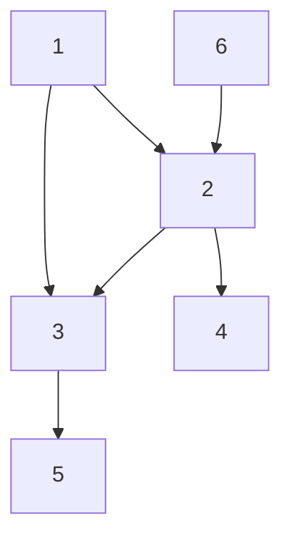

## Question

Given a graph and a destination node on the graph return true, if there's a path from the source node to the destination node.

#### input:

source: 1

Destination: 4



#### Output:

TRUE

## Solution

We can solve this either using depth-first search or using breadth-first search. For our solution here we will use depth-first search.

When looking at the time complexity of the algorithm we can say that _**n**_ would be the number of nodes and _**e**_ the number of edges. Thus we can state in the worse case our time complexity would be O(n+e), and our space complexity would be O(n).

#### Javascript

```javascript
const depthFirstSearch = (graph, source, destination) => {
  if (source === destination) {
    return true;
  }
  for (const neighbor of graph[source]) {
    if (depthFirstSearch(graph, neighbor, destination) === true) {
      return true;
    }
  }
  return false;
};
```

#### Java

```java

```

## Concepts

- [[data-structures.Graphs]]
- [[data-structures.Graphs.traverse]]

## Patterns

- DFS
