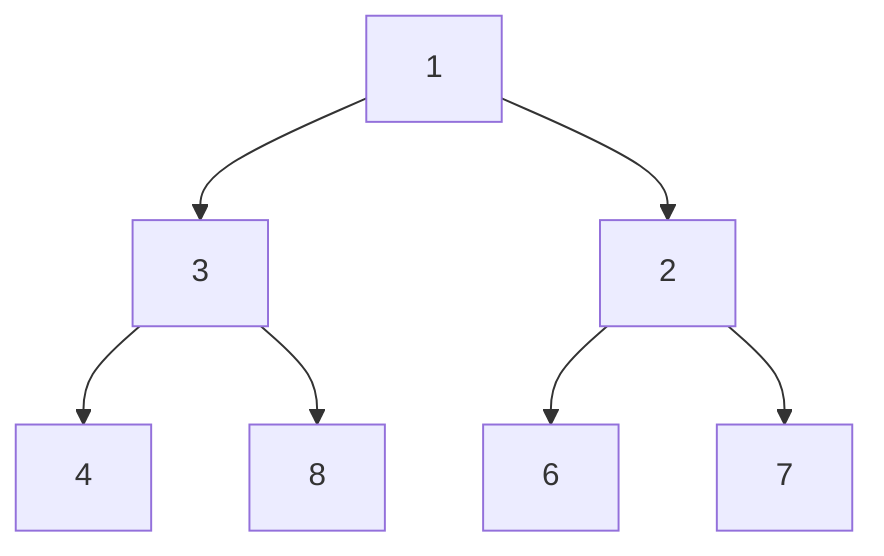

## Question

#### input:


```mermaid
graph TD;
    1-->3;
    1-->2;
    2-->6;
    2-->7;
    3-->4;
    3-->8;
```

#### Output:

## Solution

#### Javascript

```javascript

```

#### Java

```java

```

## Concepts

## Patterns
