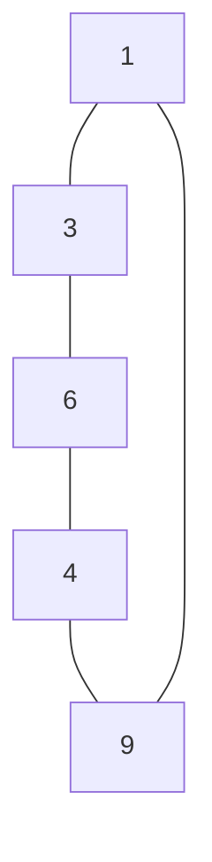

## Question

given an edge list and a start/end node return the shortest path in the graph.

#### input:

```javascript
const edges = [
  [1, 2],
  [2, 3],
  [5, 3],
  [5, 4],
  [1, 4],
];
```

#### Output:

path-length=2

## Solution

For this problem, it first helps to visualize the graph like below.



So if we have our start node be 6 and our end node be 9, we can then count the number of edges between the start and end, if we go through 3 we find that the number of edges is 3, and if we go through 4 our edge length is 2. comparing both we find that our shortest path is 2 and return that.

So we can implement this simply and fast through a breadth-first traversal. Because if we choose a depth first traversal we would be forced to look through one direction until the end. Which would be inefficient in worst case(aka chosen the wrong direction) if we had a large graph.

So if we go through breadth-first traversal we will know that the first time we encounter the node will be the shortest path to the given end node.

When we create our queue for our breadth-first traversal other keeping track our node we would also track the distance from the start node with it.

#### Javascript

```javascript
const shortPath = (edges, start, end) => {
  const visited = new set();
  const graph = createGraph(edges);
  return helper(graph, start, end, visited);
};

const createGraph = (edges) => {
  const graphs = {};
  for (const items of edges) {
    const [a, b] = items;
    if (!(a in graphs)) graphs[a] = [];
    if (!(b in graphs)) graphs[b] = [];
    graphs[a].push(b);
    graphs[b].push(a);
  }
  return graphs;
};
const helper = (graph, start, end, visited) => {
  const queue = [[start, 0]];

  while (queue.length > 0) {
    const [current, distance] = queue.shift();
    if (neighbor === end) return distance;
    for (const neighbor of graph[current]) {
      if (visited.has(neighbor)) continue;
      visited.add(neighbor);
      queue.push([neighbor, distance++]);
    }
  }
  return -1;
};
```

#### Java

```java

```

## Concepts

- [[data-structures.Graphs]]
- [[data-structures.Graphs.traverse]]

## Patterns

- BFS
- Set/Map
