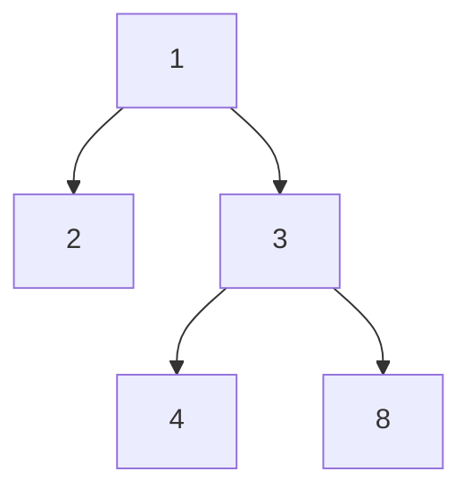

## Question

Given the root of a binary tree, return the length of the diameter of the tree.

The diameter of a binary tree is the length of the longest path between any two nodes in a tree. This path may or may not pass through the root.

The length of a path between two nodes is represented by the number of edges between them.

https://leetcode.com/problems/diameter-of-binary-tree/

#### input:



#### Output:

3

length of path (8-3-1-2)

## Solution

#### Javascript

```javascript
class BinaryTree {
  constructor(value) {
    this.value = value;
    this.left = null;
    this.right = null;
  }
}

function binaryTreeDiameter(tree) {
  // Write your code here.
  let diameter = 0;

  dfs(tree);

  return diameter;

  function dfs(node) {
    if (!node) return 0;

    const left = dfs(node.left);
    const right = dfs(node.right);

    // update diameter at every node
    diameter = Math.max(diameter, left + right);

    // update the largest number of edge so far
    return 1 + Math.max(left, right);
  }
}
```

```javascript
function binaryTreeDiameter(tree) {
  // Write your code here.
  let res = 0; //result --> diameter of tree

  let solve = function (root) {
    if (root === null) return 0;

    let l = solve(root.left);
    let r = solve(root.right);

    let temp = 1 + Math.max(r, l);
    let ans = l + r; // temporary answer
    res = Math.max(ans, res); // final result(ans)
    return temp;
  };
  solve(tree);
  return res;
}
```

#### Java

```java

```

## Concepts

- [[data-structures.recursion]]
- [[data-structures.binary-trees]]
- [[data-structures.binary-trees.traverse]]

## Patterns

- DFS
