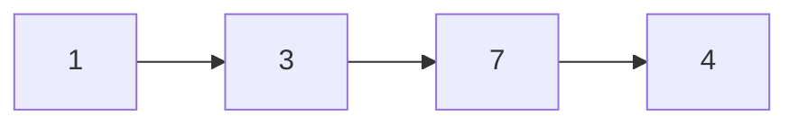

## Question

Given the head of a singly linked list, return the middle node of the linked list.

If there are two middle nodes, return the second middle node.

#### input:



#### Output:

7

## Solution

we will have two pointers, our second pointer will be moving through our list two steps at a time. So if that pointer reaches the end of our list, we know that our first pointer is at the middle of our linked list.

#### Javascript

```javascript
var middleNode = function (head) {
  let p1 = head,
    p2 = head;
  while ((p2 !== null) & (p2.next !== null)) {
    p1 = p1.next;
    p2 = p2.next.next;
    if (p2 == null) break;
  }
  return p1;
};
```

#### Java

```java

```

## Concepts

- [[data-structures.linked-list]]

## Patterns

- Two Pointers
