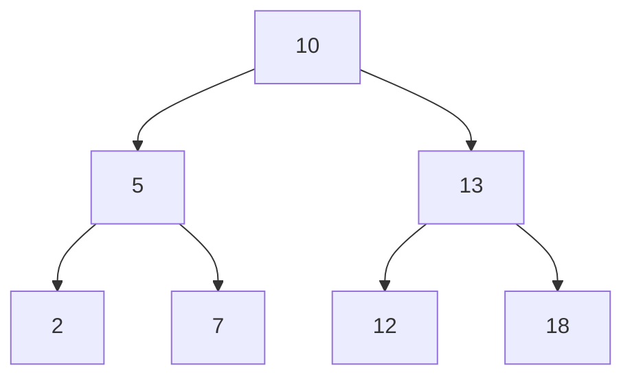

Find Closest Value in BST

## Question

Given a binary search tree and a target integer, return the closest value to the target in contained in the bst.

#### input:



Target value : 11

#### Output:

output: 12

## Solution

#### Javascript

```javascript
function findClosestValueInBst(tree, target) {
  return BSTHelper(tree, target, tree.value);
}
function BSTHelper(tree, target, output) {
  if (tree === null) {
    return output;
  } else if (Math.abs(target - output) > Math.abs(target - tree.value)) {
    output = tree.value;
  }

  if (tree.value < target) {
    return BSTHelper(tree.right, target, output);
  } else if (tree.value > target) {
    return BSTHelper(tree.left, target, output);
  } else {
    return output;
  }
}
```

#### Java

```java

```

## Concepts
