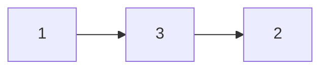
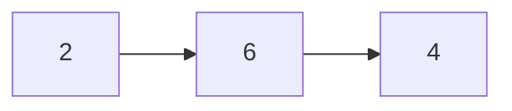

## Question

given two heads of linked list, sum the nodes of the linked lists and return a new linked list representing the sum.

#### input:




#### Output:



## Solution

We can solve this by first having two pointers to keep track of the two lists, and creating our new linked list. Once we have everything set up we can iterate through the lists. at each node we will check if the current node is null and assign a temporary variable with 0 or the node value. We can then simply add the two temp variables and our float/carry number. we can then add our new node to the list containing our sum value and iterate through the list with our new carry/float value if there is one.

#### Javascript

```javascript
const addLists = (head1, head2) => {
  // todo
  var current1 = head1;
  var current2 = head2;
  let Result = new Node(null);
  let Head = Result;
  let float = 0;
  while (current1 !== null || current2 !== null || float !== 0) {
    let val1 = current1 === null ? 0 : current1.val;
    let val2 = current2 === null ? 0 : current2.val;
    let temp = val1 + val2 + float;
    float = temp > 9 ? 1 : 0;
    let remainder = temp % 10;
    Result.next = new Node(remainder);
    Result = Result.next;
    if (current1 !== null) current1 = current1.next;
    if (current2 !== null) current2 = current2.next;
  }
  return Head.next;
};
```

#### Java

```java

```

## Concepts

- [[data-structures.linked-list]]
- [[data-structures.linked-list.single-linked-list]]

## Patterns

- Two Pointer/Iterator
