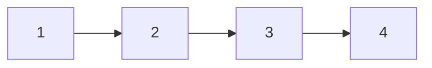

## Question

Given an array of values, create a linked list containing each element of the array.

#### input:

[1,2,3,4]

#### Output:



## Solution

We first create a dummy node head which is null and have our current pointer set to that head. Then we
We can solve this by simply iterating over the array, and setting the next value of our current pointer to the new node.
we can then return the next our dummy head to get the head of our newly created linked list.

#### Javascript

```javascript
const createLinkedList = (values) => {
  var head = new Node(null);
  var current = head;
  for (const val of values) {
    var newNode = new Node(val);
    current.next = newNode;
    current = current.next;
  }
  return head.next;
};
```

#### Java

```java

```

## Concepts

- [[data-structures.linked-list]]
- [[data-structures.linked-list.single-linked-list]]

## Patterns

- Two Pointer/Iterator
