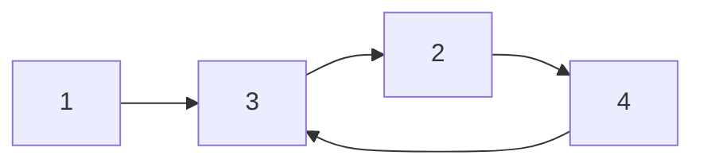

## Question

Given the head of a linked list, return the length of the cycle. If there is no cycle, return null.

#### input:



#### Output:

output:3

## Solution

To solve this we can use similar approach as the first cycle problem, Once we have reached a point where we have found a cycle, we can call a function which then goes through the list from the point the cycle was found to find the length of our cycle in our list.

#### Javascript

```javascript
var lengthCycle = function (head) {
  let p1 = head,
    p2 = head;
  while (p2 !== null && p2.next.next !== null) {
    p2 = p2.next.next;
    p1 = p1.next;
    if (p1 === p2) {
      return help(p2);
    }
  }
  return null;
};
const help = (p2) => {
  let count = 0,
    p1 = p2;
  while (p1 !== null) {
    p1 = p1.next;
    count++;
    if (p2 === p1) {
      break;
    }
  }
  return count;
};
```

#### Java

```java

```

## Concepts

- [[data-structures.linked-list]]
- [[Problems.linked-lists.cycle]]

## Patterns

- Fast & Slow Pointers
