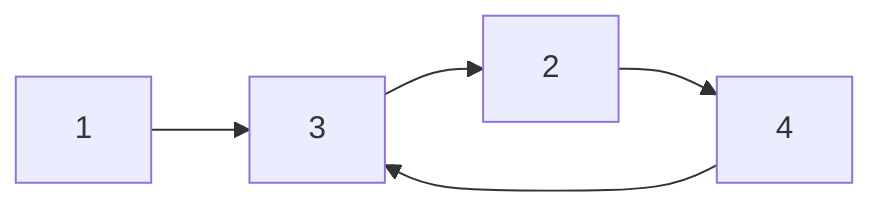

## Question

Given the head of a linked list, return the node where the cycle begins. If there is no cycle, return null.

There is a cycle in a linked list if there is some node in the list that can be reached again by continuously following the next pointer. Internally, pos is used to denote the index of the node that tail's next pointer is connected to (0-indexed). It is -1 if there is no cycle. Note that pos is not passed as a parameter.

Do not modify the linked list.

#### input:



#### Output:

3

## Solution

We can solve this using either a fast and slow pointer or a set.

For the fast and slow pointer approach. we will need to make use of two functions, one will find the length of our cycle, and once we find our length we can find our starting point using another function. We will pass our length of the cycle and head of the linked list to that function, and increment our second/fast pointer by the length of the cycle. Then we loop through the cycle until we find that both pointers are equal. At that point we can simply return any pointer as that is our starting point.

If we use the set approach, we will simply iterate through the array, and once we reach a value that is already in our set. We can simply return it as that node is where the cycle begins.

#### Javascript

```javascript
var detectCycle = function (head) {
  let p1 = head,
    p2 = head;
  while (p2 !== null && p2.next !== null) {
    p2 = p2.next.next;
    p1 = p1.next;
    if (p1 === p2) {
      let length = lengthCycle(p2);
      return startCycle(head, length);
    }
  }
  return null;
};
var lengthCycle = function (p2) {
  let count = 0,
    p1 = p2;
  while (p1 !== null) {
    p1 = p1.next;
    count++;
    if (p2 === p1) {
      break;
    }
  }
  return count;
};
var startCycle = function (head, length) {
  let p1 = head,
    p2 = head;
  for (let i = 0; i < length; i++) {
    p2 = p2.next;
  }
  while (p2 !== p1) {
    p1 = p1.next;
    p2 = p2.next;
  }
  return p1;
};

//// OR
var detectCycle = function (head) {
  const mem = new Set();
  return help(head, mem);
};
const help = (node, mem) => {
  if (!node) return null;
  if (!mem.has(node)) {
    mem.add(node);
  } else {
    return node;
  }
  return help(node.next, mem);
};
```

#### Java

```java

```

## Concepts

- [[data-structures.linked-list]]
- [[Problems.linked-lists.cycle-length]]

## Patterns

- Fast & Slow pointer
- Map/set
