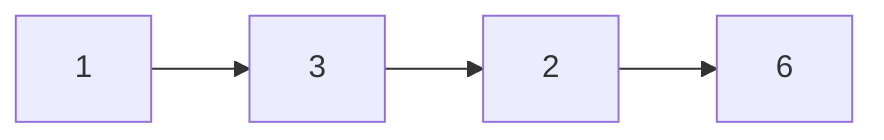
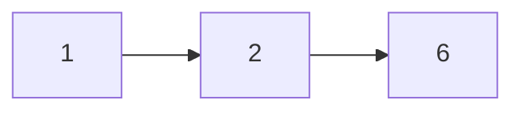

## Question

Given the head of a singly linked list, and a target value. Delete only the first instance of the node with the target value and return the head of the list.

#### input:



target= 3

#### Output:



## Solution

We can simply iterate over the list until we find a node with the same value as our target value. Once we have that we can simply set the next of our previous node to our next node of the current node we are on. Then we can simply set our node of our current node to null. As this is a singly linked list we need a variable to track the previous node.

#### Javascript

```javascript
const removeNode = (head, targetVal) => {
  var current = head;
  var previous = null;
  while (current !== null) {
    if (current.val === targetVal) {
      break;
    }
    previous = current;
    current = current.next;
  }
  if (previous === null) {
    head = current.next;
    current.next = null;
  } else {
    previous.next = current.next;
    current.next = null;
  }
  return head;
};
```

#### Java

```java

```

## Concepts

- [[data-structures.linked-list]]
- [[data-structures.linked-list.single-linked-list]]

## Patterns

- Two Pointer/Iterator
