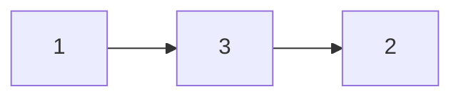
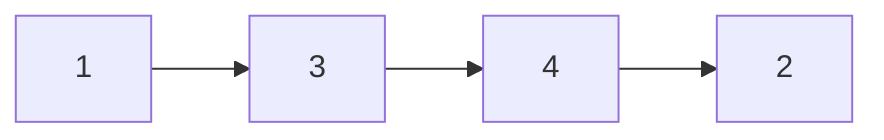

## Question

given a head of a linked list, a value, and an index. insert the value at the given index within the list.

#### input:



index=2
value=4

#### Output:



## Solution

Similar to our delete node function, we need to keep track of the previous node in the list. We can then traverse through our list, until we are at the specified index. at that point we can add our new node with the value to the list

#### Javascript

```javascript
const insertNode = (head, value, index) => {
  let count = 0;
  var prev = null;
  var current = head;
  let newNode = new Node(value);
  while (current !== null) {
    if (count === index) {
      break;
    }
    count++;
    prev = current;
    current = current.next;
  }
  console.log(count, index);
  if (prev === null) {
    newNode.next = current;
    return newNode;
  } else {
    prev.next = newNode;
    newNode.next = current;
  }
  return head;
};
```

#### Java

```java

```

## Concepts

- [[data-structures.linked-list]]
- [[data-structures.linked-list.single-linked-list]]

## Patterns

- Two Pointer/Iterator
