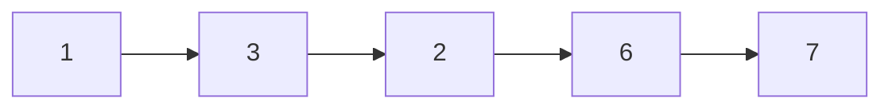

## Question

Given a head of a linked list, return the longest consecutive streak of a node with the same value.

#### input:



#### Output:

1

## Solution

To solve this we can use a map to store the values of the nodes as key and their frequency. We can do this for all nodes, incrementing their frequency value if we find one that is consecutive. We have to reset though if we find the same element is not consecutive. Thus we use a previous variable to keep track of the value of the previous node.

#### Javascript

```javascript
const mem = {};
var max = 0;
var prev = null;
while (head !== null) {
  if (!mem[head.val]) {
    mem[head.val] = 1;
    prev = head;
  } else {
    if (head.val !== prev.val && mem[head.val] > 0) {
      mem[head.val] = 1;
    } else {
      mem[head.val] += 1;
    }
  }
  console.log(mem);
  prev = head;
  max = Math.max(mem[head.val], max);
  head = head.next;
}
return max;
```

#### Java

```java

```

## Concepts

- [[data-structures.linked-list]]
- [[data-structures.linked-list.single-linked-list]]

## Patterns

- Two Pointer/Iterator
- Map/Set
