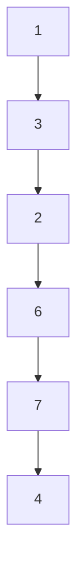
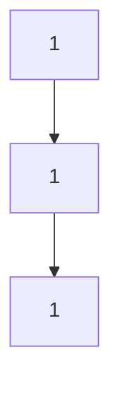

## Question

given a head of a linked list return a boolean indicating whether there exists exactly one unique value.

#### input:

Link 1



Link 2



#### Output:

FALSE

TRUE

## Solution

we can solve this using a set or a variable to hold the first value of our head, and check if all the nodes in the list contain exactly the same value, if not we can simply return false.

#### Javascript

```javascript
const isUniqueValueList = (head) => {
  // todo
  const set = new Set();
  set.add(head.val);
  while (head !== null) {
    if (!set.has(head.val)) {
      return false;
    }
    head = head.next;
  }
  return true;
};
```

#### Java

```java

```

## Concepts
