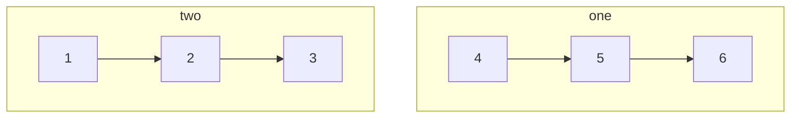
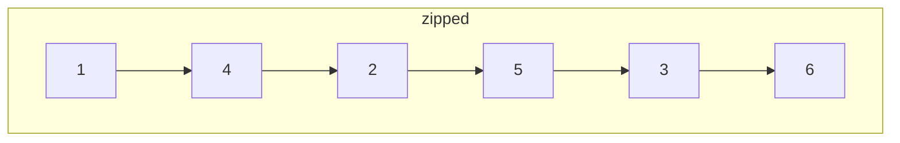

## Question

given the head of two singly linked lists, zip the two linked list into a single linked list of alternating nodes. if one is longer than the other, the list should terminate with the remaining nodes.

boths inputs are non empty, and do not mutate original nodes. your function should return the head of the zipped linked list

#### input:



#### Output:



## Solution

Now we can solve this question using two pointers to keep track of the two linked list, and another pointer to keep track of the tail of our new node.

#### Javascript

```javascript

```

#### Java

```java

```

## Concepts

- [[data-structures.linked-list]]
- [[data-structures.linked-list.single-linked-list]]

## Patterns

- Two Pointer/Iterator
