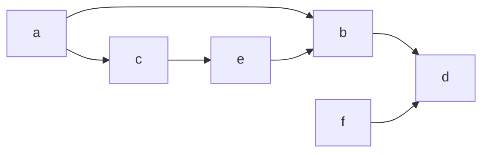

When trying to implement a graph in our preferred language of choice, we can represent graphs in an adjacency list (hashmap data structure), this can be an object for javascript, and unordered map for java.



```javascript
const graph = {
  a: [b, c],
  b: [d],
  c: [e],
  d: [],
  e: [b],
  f: [d],
};
```

### Depth First Traversal

For depth first traversal, given a source node, the algorithm travels through the graph and explores until it reaches the end of the given path before backtracking.

So in our given example graph, if our source node is A, one path we could take is: [A,C,E,B,D] if we had chosen b instead of C our path would look like [A,B,D].

To Build a depth first traversal algorithm we can use a data structure we learned previously a stack to implement this. And we know that Stack works on the LIFO, so we can first visualize how this will work on our graph.


As seen above if we initialize our stack with the node A, we can then pop node A of our stack and push into the stack the neighbors of A. Then we can go through the whole graph by popping an element from the stack and pushing the neighbors of the current node until the stack is empty. At that point we have traversed through all nodes in the graph, using the depth-first traversal method.

Now we can implement Depth First Traversal in our code in two ways, iteratively or recursively.

For our first method we will choose to use the recursive method which is simpler than the iterative method.

```javascript
const depthFirstSearch = (graph, source) => {
  console.log(source);
  for (const neighbor of graph[source]) {
    depthFirstSearch(graph, neighbor);
  }
};
```

and our iterative method will look something like this:

```javascript
const depthFirstSearch = (graph, source) => {
  const stack = [source];

  while (stack.length > 0) {
    const currentNode = stack.pop();
    console.log(currentNode);
    for (const neighbor of graph[currentNode]) {
      stack.push(neighbor);
    }
  }
};
```

### Breadth First Traversal

For Breadth first traversal, given a source node, the algorithm travels through the graph and explores all given nodes at the current depth it's at, before traversing to the next depth of the graph until it reaches the end.

So in our given example graph at the top, if our source node is A, a path we could take would look something like this: [A,B,C,D,E,F].

To Build a Breadth first traversal algorithm we can use a data structure we learned previously a Queue to implement this. And we know that Queue works on the FIFO method, so we can first visualize how this will work on our graph.


As seen above if we initialize our Queue with the node A, we can then shift node A of our Queue and push into the Queue the neighbors of A. Then we can go through the whole graph by shifting an element from the Queue and pushing the neighbors of the current node until the Queue is empty. At that point we have traversed through all nodes in the graph, using the Breadth-first traversal method.

Different from our Depth-first traversal, breadth-first traversal can only be performed iteratively.

```javascript
const breadthFirstSearch = (graph, source) => {
  const Queue = [source];

  while (Queue.length > 0) {
    const currentNode = Queue.shift();
    console.log(currentNode);
    for (const neighbor of graph[currentNode]) {
      Queue.push(neighbor);
    }
  }
};
```

### Related Topics

- [[data-structures.stacks]]
- [[data-structures.queues]]
