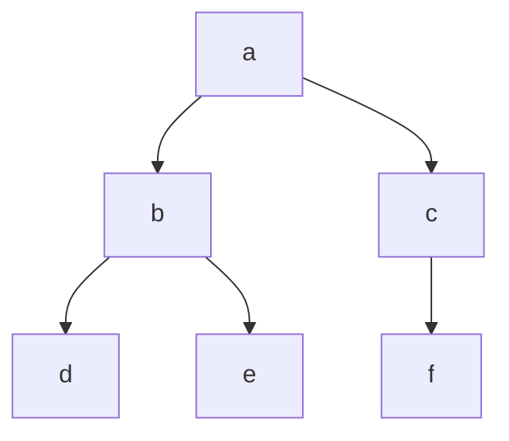

When you navigate through a tree and find all the data it contains you call that a traversal, as it traverses the whole binary tree.


The first method of traversal is called is pre-order traversal

For this you can use a simple recursion algorithm to traverse the tree and print all the letters contained by the nodes.

```javascript
function BSTpre(tree) {
  if (tree) {
    print(tree.value);
    BSTpre(tree.left);
    BSTpre(tree.right);
  }
}
```

The second method is called in-order traversal where you go around the tree counterclockwise. In this case the letter is only printed after it has traversed down the left branch. Using this method in a sorted binary tree, you are able to print all numbers in the correct order.

```javascript
function BSTinOrder(tree) {
  if (tree) {
    BSTinOrder(tree.left);
    print(tree.value);
    BSTinOrder(tree.right);
  }
}
```

The last method is called post-order traversal similar to in-order traversal you go through the tree counterclockwise but you print the value of each node as you pass the right side instead of the left like in-order. Each value is printed the last time it is reached recursively as it moves left and then right to print the data last.

```javascript
function BSTpost(tree) {
  if (tree) {
    BSTpost(tree.left);
    BSTpost(tree.right);
    print(tree.value);
  }
}
```

The method you use to traverse the tree depends on what you are trying to do.

## Depth First Search



DFS is an algorithm where you go down a branch until the leaf is reached and process and proceed to another branch and so on. DFS usually make use of a stack to track all the visited nodes. For depth first search we can utilize any of the methods we outlined above. The basic implementation of a DFS on a binary tree is the pre-order traversal.

So for the given binary tree above for our DFS if we utilized a pre-order traversal we would come up with the result shown below:

pre-order : ['a', 'b', 'd', 'e', 'c', 'f' ]

Below we can see similar implementation of of a depth first search on a tree, recursively and iteratively using a stack.

```javascript
//Recursive
//under the hood js will use a stack structure to keep track of all recursive calls.
function depthFirstTree(tree) {
  if (tree === null) return [];
  const leftValue = depthFirstTree(tree.left); //[b,d,e]
  const rightValue = depthFirstTree(tree.right); //[c,f]
  return [tree, ...leftValue, ...rightValue]; //spread operator
}
//DFS: ['a', 'b', 'd', 'e', 'c', 'f' ]
//Iterative
function depthFirstTree(tree) {
  if (tree === null) return [];
  let result = [];
  const stack = [tree];
  while (stack.length > 0) {
    const current = stack.pop();
    result.push(current.value);
    if (current.left) stack.push(current.left);
    if (current.right) stack.push(current.right);
  }
  return result;
  //DFS: ['a', 'b', 'd', 'e', 'c', 'f' ]
}
```

## Breadth First Search


BFS is an algorithm that is counterpart to DFS, where DFS make use of a stack BFS makes use of a queue for its data array. Thus elements are visited in a first in first out method(FIFO). This can also be called level order traversal as all nodes on a given level are visited before going to the next level.

BFS is usually used in maps for finding the shortest route (google maps) or finding how many friend links/ relations you are from someone (facebook or linkedin). BFS is used often when you are looking for the "nearest" solution.

Below we can see an implementation of a breadth-first search on a tree. Here as it's a breadth First search we have to implement it iteratively using a queue.

```javascript
function breadthFirstTree(tree) {
  if (tree === null) return [];
  const queue = [tree];
  const result = [];
  while (queue.length > 0) {
    let current = queue.shift();
    result.push(current.val);
    if (current.left) queue.push(current.left);
    if (current.right) queue.push(current.right);
  }
  return result;
}
//BFS ['a', 'b', 'c', 'd', 'e', 'f']
```

So in total the traversal algorithm are as follows:

- BFS
- pre-order traversal
- in-order traversal
- post-order traversal
