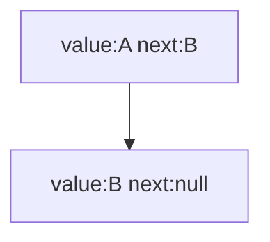
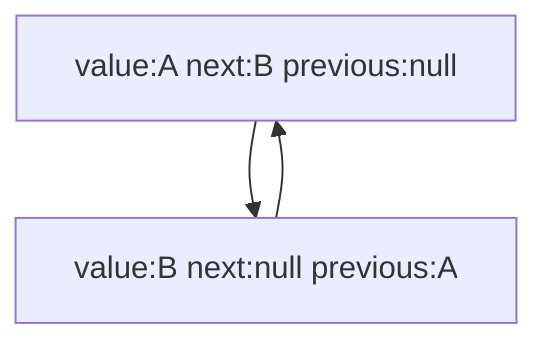

Linked Lists are Linear Data Structures that hold data in nodes, and where each element is arranged/stored sequentially. But they are also recursive data structures as linked lists are composed of smaller instances of themselves(nodes). The data they held by the node is composed of a value and a pointer to another node.

Single Linked List

Doubly Linked List

When looking at the linked list we can see that it has an insertion of O(1) but comparatively worse look up time of (n). This look up time is related to the fact that you have to traverse the linked list to find the right insertion or lookup point. As to get the 50th element in a linked list, you would have to traverse 49 nodes from the head node to reach it.
