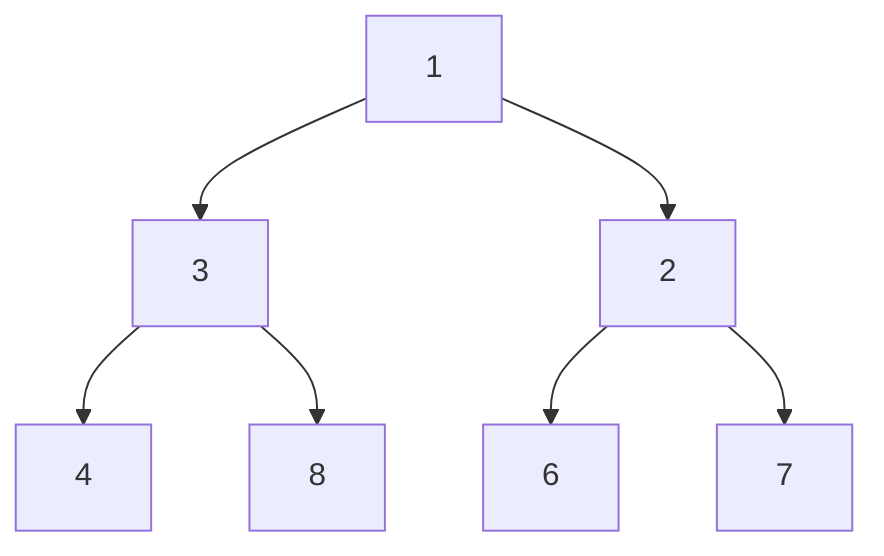

## Question

Given a binary tree return a list of branch sums from left branch to right branch.

#### input:



#### Output:

[8,12,9,10]

## Solution

#### Javascript

```javascript
class BinaryTree {
  constructor(value) {
    this.value = value;
    this.left = null;
    this.right = null;
  }
}
function branchSums(root) {
  let output = [];
  calculateSum(root, 0, output);
  return output;
}

function calculateSum(node, countingval, output) {
  if (node === null) {
    return;
  }

  const curentSum = countingval + node.value;
  if (!node.left && !node.right) {
    output.push(curentSum);
    return;
  }
  calculateSum(node.left, curentSum, output);
  calculateSum(node.right, curentSum, output);
}
```

#### Java

```java
import java.util.*;

class Program {
  // This is the class of the input root. Do not edit it.
  public static class BinaryTree {
    int value;
    BinaryTree left;
    BinaryTree right;

    BinaryTree(int value) {
      this.value = value;
      this.left = null;
      this.right = null;
    }
  }

  public static List<Integer> branchSums(BinaryTree root) {
    // Write your code here.
		 List<Integer> output = new ArrayList<Integer>();
		 calculateSum(root,0,output);
    return output;
  }
	public static void calculateSum(BinaryTree node, int countingval, List<Integer> output){
		if (node == null){
			return;
		}
		int currentSum = countingval + node.value;
		 if (node.left == null && node.right  == null) {
    output.add(currentSum);
    return;
  }
  calculateSum(node.left, currentSum, output);
  calculateSum(node.right, currentSum, output);
	}
}

```

## Concepts

- [[data-structures.recursion]]
- [[data-structures.binary-trees]]

## Patterns

- Tree Depth First Search
