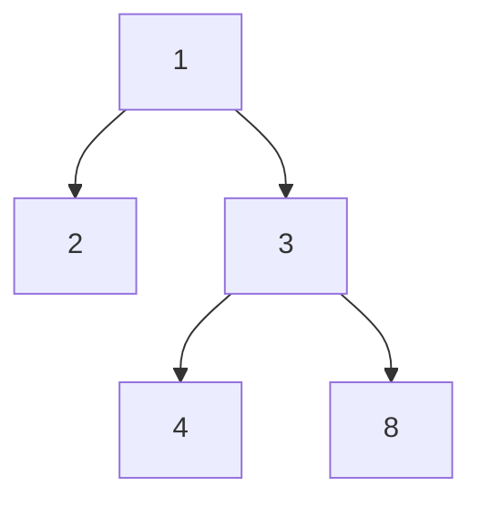

## Question

Given a Binary Tree and a node contained in the tree, return the nodes successor.

A nodes successor is the next node to be visited when traversing the tree using the in-order tree traversal algorithm. a node has no successor if its the last node to be visited in the in-order tree traversal.

#### input:



node = 4

#### Output:

8

## Solution

in order traversal of the tree above gives us the following [2,1,3,4,8]
if node is 4 what follows is 8, thus it is the successor of the node.

#### Javascript

```javascript
class BinaryTree {
  constructor(value) {
    this.value = value;
    this.left = null;
    this.right = null;
    this.parent = null;
  }
}

function findSuccessor(tree, node) {
  let out = [];
  inOrderTraversal(tree, out);
  console.log(out);
  for (let i = 0; i < out.length; i++) {
    if (i === out.length - 1) return null;
    if (out[i] === node) {
      return out[i + 1];
    } else {
      continue;
    }
  }
}
function inOrderTraversal(tree, out) {
  if (tree) {
    inOrderTraversal(tree.left, out);
    out.push(tree);
    inOrderTraversal(tree.right, out);
    return out;
  } else {
    return out;
  }
}
```

#### Java

```java

```

## Concepts

- [[data-structures.binary-trees.traverse]]
- [[data-structures.recursion]]

## Patterns

- DFS
