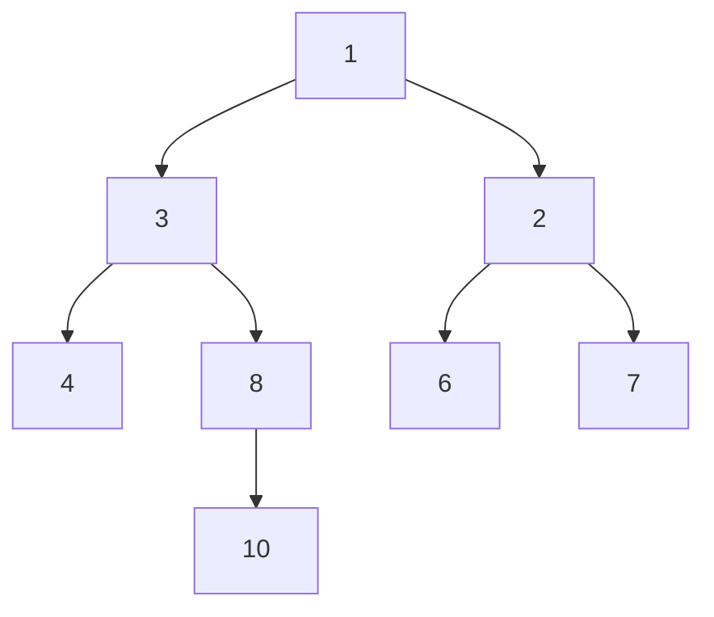
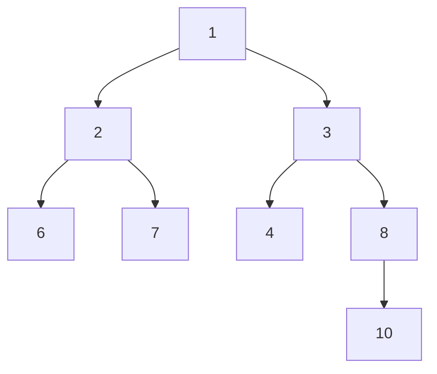

## Question

Given a Binary Tree, invert it.

#### input:



#### Output:



## Solution

#### Javascript

```javascript
function invertBinaryTree(tree) {
  // Write your code here.
  return helper(tree);
}
function helper(tree) {
  if (!tree) {
    return;
  }
  if (!tree.left && !tree.right) {
    return;
  }
  let temp = tree.left;
  tree.left = tree.right;
  tree.right = temp;
  helper(tree.left);
  helper(tree.right);
}

// This is the class of the input binary tree.
class BinaryTree {
  constructor(value) {
    this.value = value;
    this.left = null;
    this.right = null;
  }
}
```

#### Java

```java
import java.util.*;

class Program {
  public static void invertBinaryTree(BinaryTree tree) {
		helper(tree);
  }
	public static void helper (BinaryTree node){
		if (node == null){
			return;
		}
		BinaryTree temp = node.left;
		node.left = node.right;
		node.right = temp;
		helper(node.left);
		helper(node.right);
	}

  static class BinaryTree {
    public int value;
    public BinaryTree left;
    public BinaryTree right;

    public BinaryTree(int value) {
      this.value = value;
    }
  }
}
```

## Concepts

- [[data-structures.binary-trees.traverse]]
- [[data-structures.recursion]]

## Patterns

- DFS
