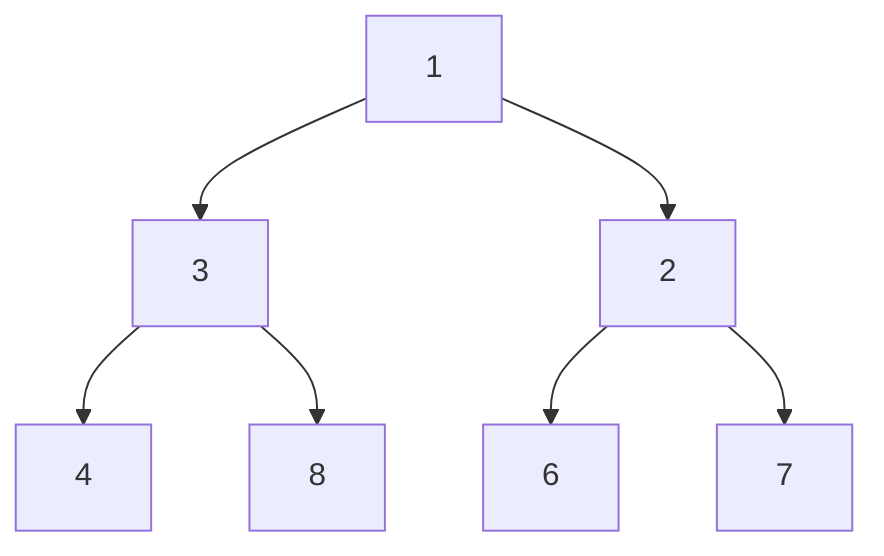

## Question

Given a root of a tree, return the total sum of all values in the binary tree.

#### input:



#### Output:

## Solution

we can solve this by traversing through the graph and adding all our values as we go.

This can be done either through DFS (pre,post,in) or BFS.

#### Javascript

```javascript
const treeSum = (root) => {
  if (root === null) return 0;
  return root.val + treeSum(root.left) + treeSum(root.right);
};
```

#### Java

```java

```

## Concepts

- [[data-structures.recursion]]
- [[data-structures.binary-trees]]
- [[data-structures.binary-trees.traverse]]

## Patterns

- DFS
