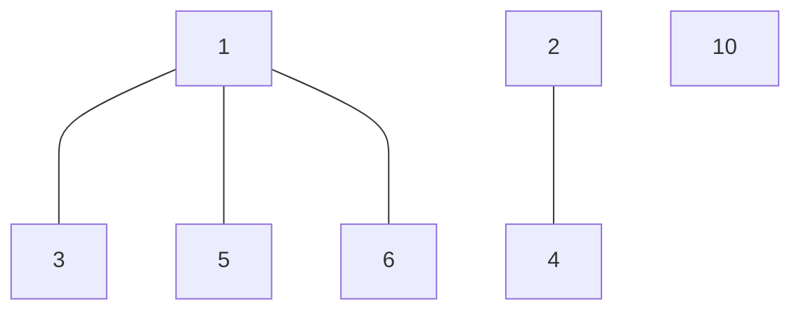

## Question

Given an unconnected graph, in the form of an adjacency list, your function should return the number of connected components within the graph.

#### input:

```javascript
const list = {
  0: [8, 1, 5],
  1: [0],
  5: [0, 8],
  8: [0, 5],
  2: [3, 4],
  3: [2, 4],
  4: [3, 2],
};
```

#### Output:

count = 2

## Solution

As the graph given is an undirected graph, when we implement our depth-first search algorithm, we need to check that we are not running into a cycle. So this section stays the same as previous problems.

The difference now is that we need to go through all the nodes in our graph iteratively to check if we have a connected component.

For example in our graph below, if we went through each node and called our depth function we can find that starting from one we will have searched all paths, and thus have visited nodes 3,5,and 6 and saved in our set. then we move to our next node 2 and do the same our connected component counter is now at 2.

When we move to node 3 we will see that we have already visited this node so we skip to the next node, and so on until we reach 10 which we have not visited. After that our count goes 3 and we have finished looping iteratively through our graph nodes.



#### Javascript

```javascript
const connectedComponents = (grpah) => {
  const visited = new set();
  const count = 0;
  for (const node in graph) {
    if (visited.has(node)) continue;
    depthFirstTraverse(graph, node, visited);
    count++;
  }
  return count;
};

const depthFirstTraverse = (graph, source, visited) => {
  if (visited.has(source)) return false;
  visited.add(source);

  for (const neighbor of graph[source]) {
    if (depthFirstTraverse(graph, node, visited) === true) {
      return true;
    }
  }
};
```

#### Java

```java

```

## Concepts
