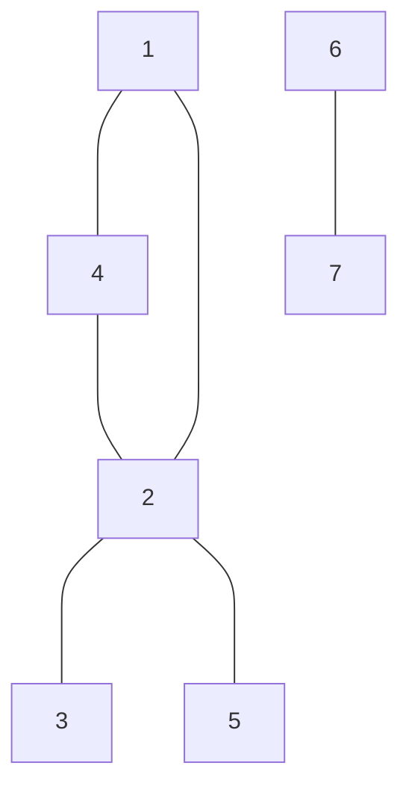

## Question

given an array of edges for an undirected graph a source node and a target node, return true if the source node has a path to the target node.

#### input:

```javascript
const edges = [
  [1, 4],
  [2, 1],
  [3, 2],
  [5, 2],
  [6, 7],
];
```

#### Output:

TRUE

## Solution

As this is a graph we can use depth-first search to find the path, the only thing that's different this time is that we have an undirected graph. It can help to visualize how the graph might look, as the image shown below. But in order to solve the problem using the previously defined methods. We need to convert from the array list of edges to an adjacency list.



After we convert the edges we have to an adjacency list we can go forward with trying to find a path to the destination.

In this case we need to change how we find the path slightly by checking if the node we're on currently has been visited. We do this so we can avoid an infinite loop.
As this graph contains a trivial cycle and a cycle of length 3.

#### Javascript

```javascript
const hasPath = (edges, start, destination) => {
  const graph = createGraph(edges);
  return depthFirstTraversal(graph, start, destination, new set());
};

const createGraph = (edges) => {
  const graphs = {};
  for (const items of edges) {
    const [a, b] = items;
    if (!(a in graphs)) graphs[a] = [];
    if (!(b in graphs)) graphs[b] = [];
    graphs[a].push(b);
    graphs[b].push(a);
  }
  return graphs;
};

const depthFirstTraversal = (graph, start, destination, visited) => {
  if (start === destination) return true;
  if (visited.has(start)) return false;
  visited.add(start);
  for (const neighbor of graph[start]) {
    if (
      (depthFirstTraversal = (graph, neighbor, destination, visited) === true)
    ) {
      return true;
    }
  }
  return false;
};
```

#### Java

```java

```

## Concepts
