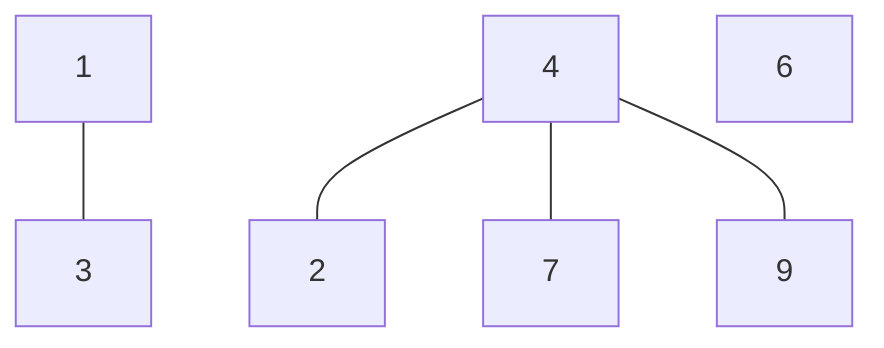

## Question

Given an adjacency list of an undirected graph, return the size of the largest component in the graph.

#### input:

```javascript
const largestComponent = {
  0: ["1", "2", "3"],
  1: ["1", "2", "3"],
  3: ["1", "2"],
  4: ["1", "2"],
};
```

#### Output:

size

## Solution

To solve the problem, we can follow the pattern of finding a path in an undirected graph. The only difference now is that we have to use a counter for which we can keep track of the size of the graph and compare to other components

for example in our example graph below we can see that our largest component would be size of 4.



#### Javascript

```javascript
const largestComp = (graph) => {
  const visited = new set();
  const largest = 0;
  for (const node of graph) {
    const current = helper(graph, node, visited);
    if (current > largest) largest = current;
  }
  return largest;
};

const helper = (graph, node, visited) => {
  if (visited.has(node)) return 0;
  visited.add(node);
  let size = 0;
  for (const neighbor of graph[node]) {
    size += helper(graph, neighbor, visited);
  }
  return size;
};
```

#### Java

```java

```

## Concepts
